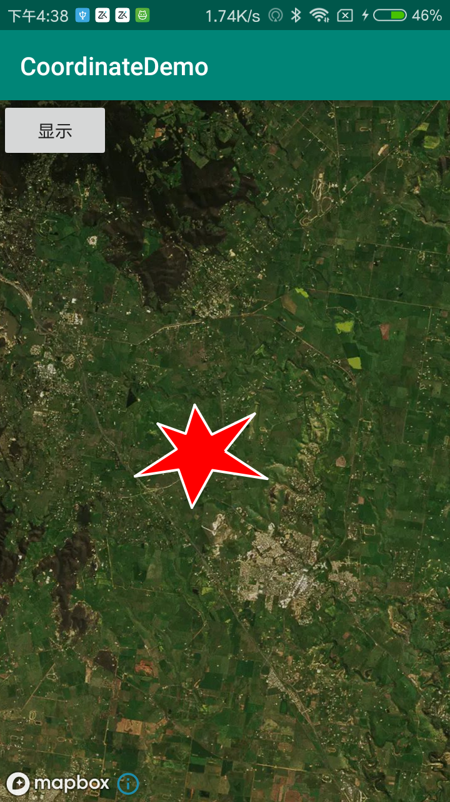
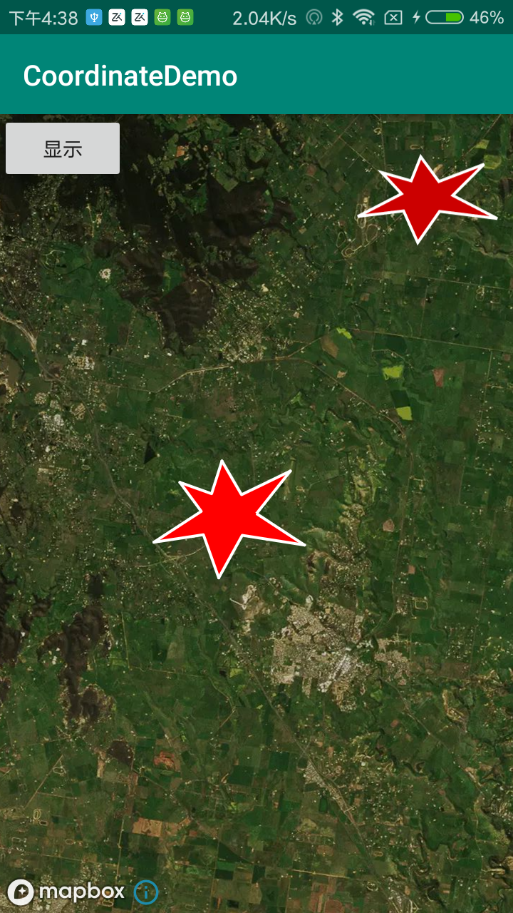

# CoordinateDemo

一个小的坐标转化工具，可以将坐标点或其他的点，转化到自定义的view上面。






可以将地图上勾画的区域，通过转化，得到制定大小View上面的坐标点。View宽高要相等。

```java
 /**
     * 根据经纬度转化到制定大小相对应的点
     *
     * @param latLngList 经纬度的集合
     * @param maxHeight  最大高度
     * @param maxWidth   最大宽度
     * @return 对应到该屏幕上的位置
     */
    public static List<Point> getPoints(List<LatLng> latLngList, int maxHeight, int maxWidth) {
        List<Point> pointList = new ArrayList<>();
        // 纬度集合  对应的是y
        List<Double> yList = new ArrayList<>();
        // 经度集合 对应的是x
        List<Double> xList = new ArrayList<>();
        for (int i = 0; i < latLngList.size(); i++) {
            yList.add(latLngList.get(i).getLatitude());
            xList.add(latLngList.get(i).getLongitude());
        }
        double yMin = yList.get(0);
        double yMax = yList.get(0);
        for (int i = 0; i < yList.size(); i++) {
            if (yMin > yList.get(i)) yMin = yList.get(i);
            if (yMax < yList.get(i)) yMax = yList.get(i);
        }
        // 纬度的最大值
        double yMinus = yMax - yMin;

        double xMin = xList.get(0);
        double xMax = xList.get(0);
        for (int i = 0; i < xList.size(); i++) {
            if (xMin > xList.get(i)) xMin = xList.get(i);
            if (xMax < xList.get(i)) xMax = xList.get(i);
        }
        // 经度的最大值
        double xMinus = xMax - xMin;

        if (yMinus > xMinus) { // 如果纬度的最大值大于经度的最大值，以纬度为核心
            double number = maxHeight / yMinus;
            for (int i = 0; i < latLngList.size(); i++) {
                double x = (xList.get(i) - xMin) * number + (maxWidth - number * xMinus) / 2 + 2;
                double y = (yList.get(i) - yMin) * number + 2;
                Point point = new Point(x, y);
                pointList.add(point);

            }
        } else { // 如果经度的最大值大于纬度的最大值，以经度为核心
            double number = maxWidth / xMinus;
            for (int i = 0; i < latLngList.size(); i++) {
                double x = (xList.get(i) - xMin) * number + 2;
                double y = (yList.get(i) - yMin) * number + (maxHeight - number * yMinus) / 2 + 2;
                Point point = new Point(x, y);
                pointList.add(point);
            }
        }
        return pointList;
    }
```

自定义LandView。

```java
  <declare-styleable name="LandView">
        <attr name="land_width" format="dimension" />  <!--线宽 -->
        <attr name="land_color" format="color" />   <!--线颜色 -->
        <attr name="fill_color" format="color" />   <!--线填充色 -->
    </declare-styleable>
```

```java
  <com.coordinate.demo.LandView
        android:id="@+id/landView"
        android:layout_width="100dp"
        android:layout_height="100dp"
        android:layout_alignParentRight="true"
        android:layout_marginTop="10dp"
        android:layout_marginRight="10dp"
        app:fill_color="@android:color/holo_red_dark"
        app:land_color="@android:color/white"
        app:land_width="2dp" />
```

